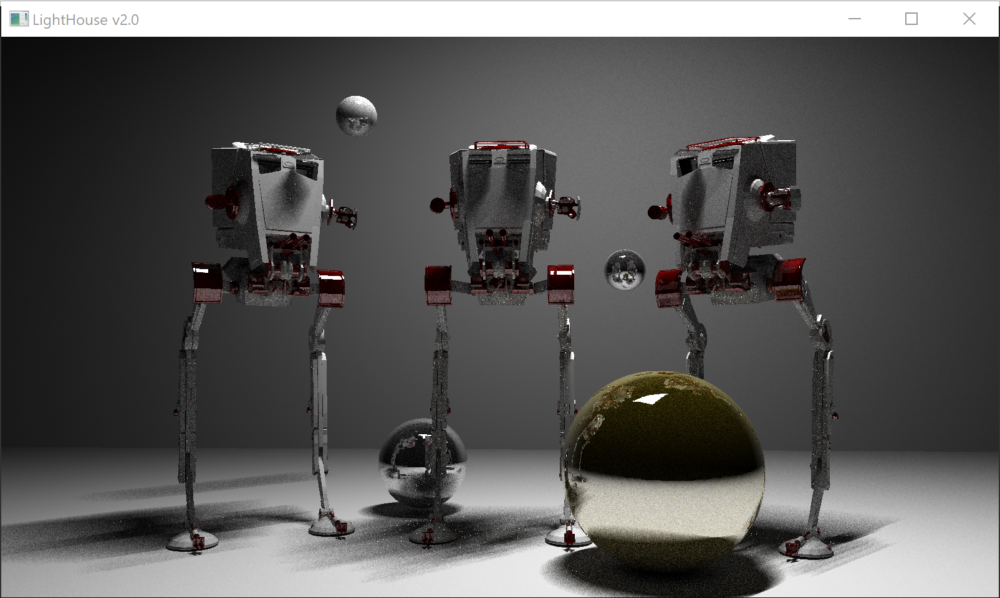
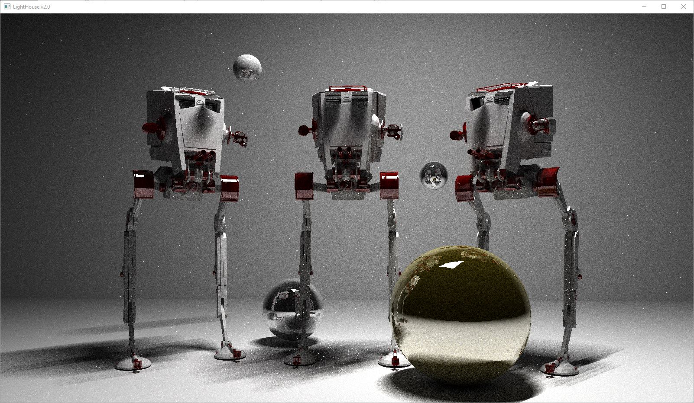
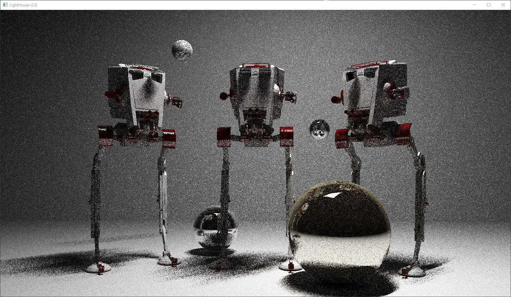
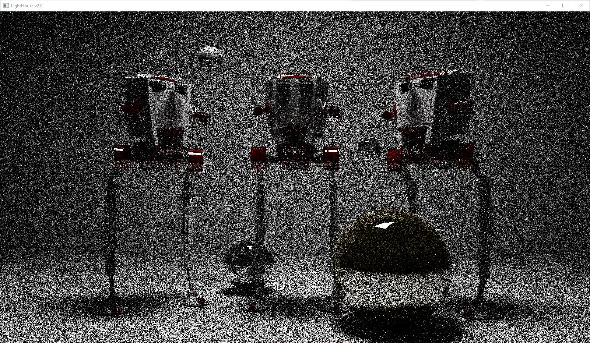
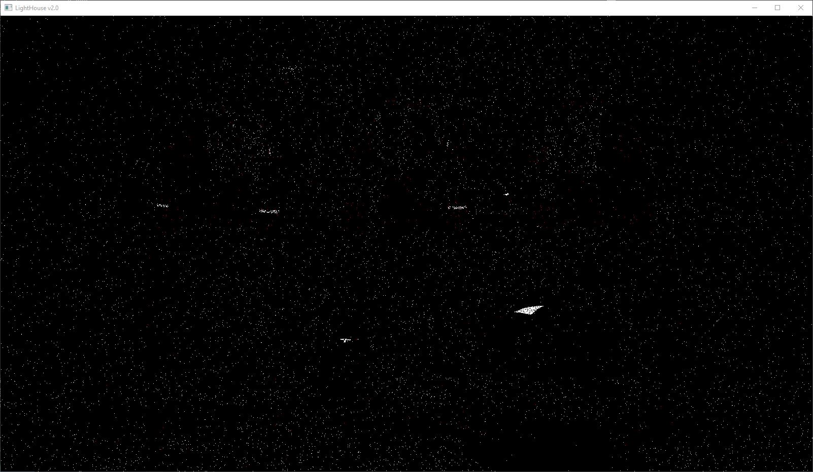
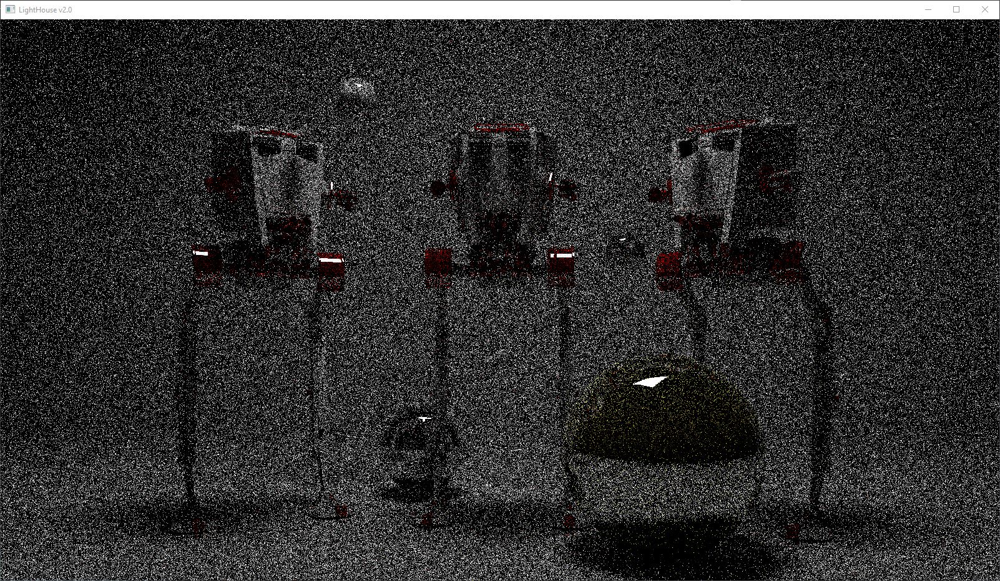
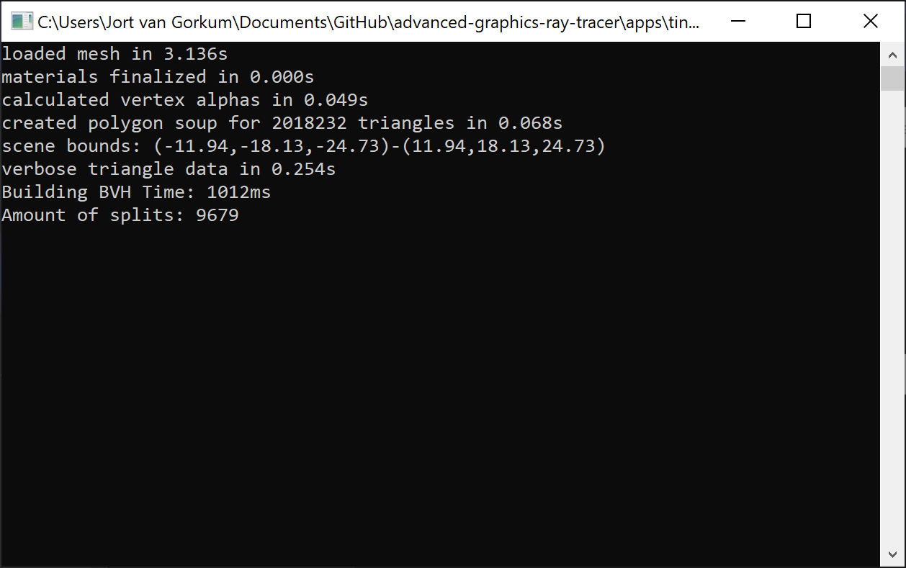
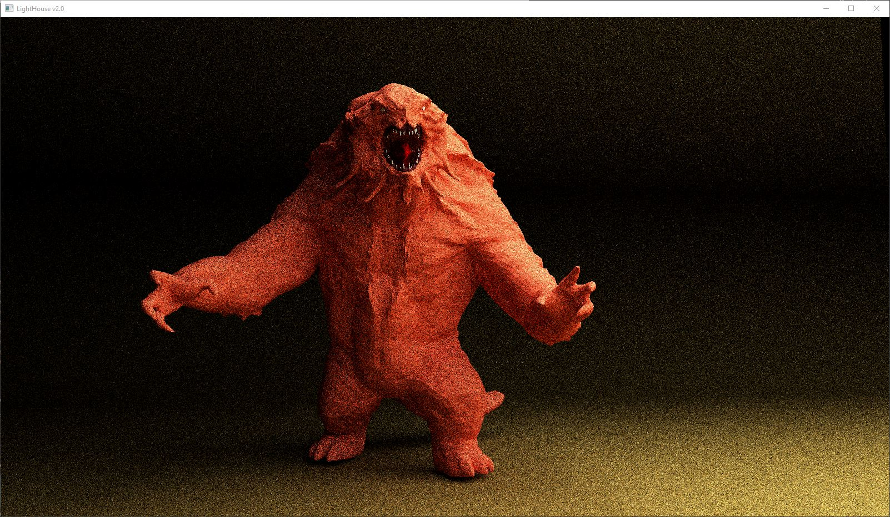
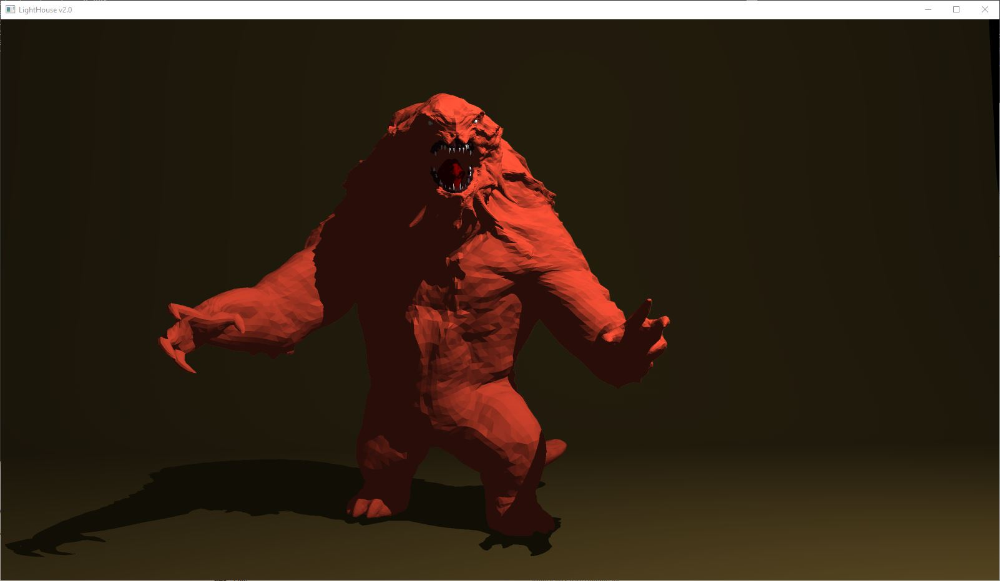

### Students:
Jort van Gorkum - 6142834
Vince van Noort - 6187021

# Part 3
Implemented:
- Adaptive Sampling 
- Next Event Estimation
- Multiple Importance Sampling

References:
- https://www.mff.cuni.cz/veda/konference/wds/proc/pdf13/WDS13_110_i5-Sik.pdf

Inspired by:
- http://www.realtimerendering.com/raytracinggems/unofficial_RayTracingGems_v1.7.pdf
  - page: 213

Below we show some example renders to demonstrate our implementations of adaptive sampling and next event estimation.

### 4k Version

### With Adaptive Sampling, Next Event Estimation & Multiple Importance Sampling
32th frame (~180s)

1th frame (~6s)

### With Adaptive Sampling & Next Event Estimation
32th frame (~180s)

1th frame (~6s)

### With Adaptive Sampling
32th frame (~180s)

1th frame (~6s)

### Without both
54th frame (~180s)

1th frame (~4s)

# Part 2
All basics done.

### Additional points implemented:
- Construct the BVH for a 2M triangle scene in less than 1 second (still using SAH; 1 pt).

Nefertiti

Configuration:
- bins = 4
- split on z-axis

Computer Specs:
- CPU: Intel i7 8750H
- Memory: 16GB

### BVH building - Monster
created polygon soup for 123216 triangles in 0.005s
Building BVH Time: 75ms

Monster Kajiya - Render time per frame ~4500ms

Monster Whitted - Render time per frame ~9600ms (with 4x anti-aliasing)

# Part 1
All basics done.

### Additional points implemented:
- Anti-aliasing (In Whitted)
- Image postprocessing: gamma correction, vignetting and chromatic aberration (in Whitted)

### Whitted Renders:
No post processing

Anti aliasing (4x)

With post processing

### Kajiya Renders:
5 iterations

25 iterations

40 iterations

Sources: 
- https://www.scratchapixel.com/lessons/3d-basic-rendering/introduction-to-shading/reflection-refraction-fresnel
- https://www.scratchapixel.com/lessons/3d-basic-rendering/global-illumination-path-tracing/global-illumination-path-tracing-practical-implementation
- https://www.shadertoy.com/view/ltcyRf
